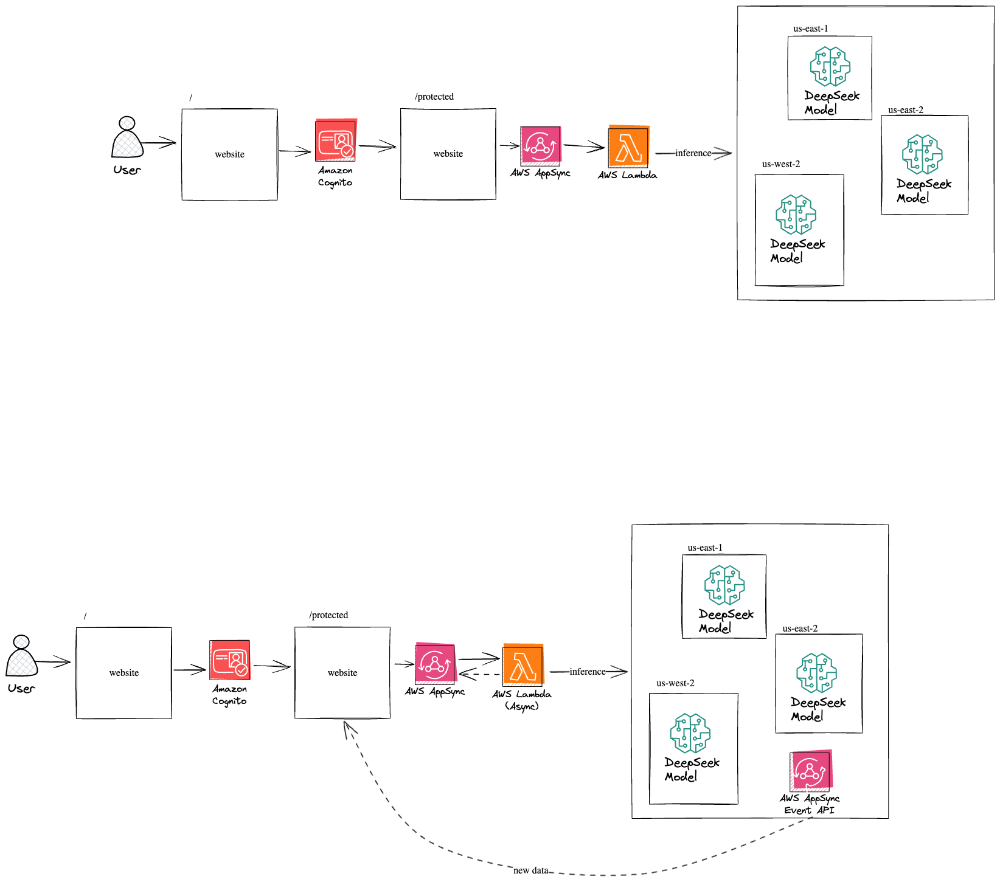

# DeepSeek Integration with AWS Bedrock

This project demonstrates a fullstack solution for integrating DeepSeek's language model with AWS services using the newly announced AWS Bedrock integration. It showcases both synchronous and streaming interactions with DeepSeek's model through a serverless architecture.

## Features

- **Serverless Architecture**: Built using AWS Amplify, Lambda, AppSync, and Bedrock
- **Cross-Region Inference**: Automatically routes requests to different AWS regions during peak hours for optimal latency
- **Dual Interaction Modes**:
  - Synchronous responses for quick queries
  - Real-time streaming for longer interactions
- **Modern Frontend**: Built with React (Vite) and DaisyUI for a beautiful user experience
- **Secure Authentication**: Integrated with Amazon Cognito for user management

## Architecture



### Backend Components

- **AWS Amplify**: Manages the infrastructure and deployment
- **AWS Lambda**:
  - `bedrockToDeepSeekSync`: Handles synchronous DeepSeek model interactions
  - `bedrockToDeepSeekStream`: Manages streaming responses with real-time updates
- **AWS AppSync**: Provides GraphQL API and real-time capabilities
- **AWS AppSync Event**: Realtime, standalone websocket
- **Amazon Bedrock**: Serverless access to DeepSeek's language model
- **Amazon Cognito**: User authentication and authorization

### Frontend Components

- **React + Vite**: Modern frontend framework
- **React Router**: Client-side routing
- **DaisyUI**: Tailwind CSS component library
- **AWS Amplify Client Libraries**: Seamless integration with backend services

## Key Benefits

1. **Serverless Operation**: No need to manage or host DeepSeek models
2. **Cost Efficiency**: Pay-per-use model with AWS Bedrock
3. **High Availability**: Cross-region inference ensures reliable performance
4. **Real-time Capabilities**: Streaming responses for interactive experiences
5. **Enterprise-Grade Security**: Built-in authentication and authorization

## Prerequisites

- Node.js and npm
- AWS Account
- AWS Amplify CLI
- Basic knowledge of React and AWS services

## Getting Started

1. Clone the repository
2. Install dependencies:
   ```bash
   npm install
   ```
3. Initialize Amplify:
   ```bash
   npx ampx sandbox
   ```

## Environment Configuration

The application requires the following environment variables:

- AWS Region configuration
- Bedrock model endpoints
- AppSync API endpoints
- Cognito user pool settings

These are automatically configured by AWS Amplify during deployment.

## Security

- All interactions with DeepSeek models are authenticated
- Cross-region requests are secured with IAM roles
- User data is protected through Cognito integration
- Real-time events are secured with user pool authentication

## Contributing

Contributions are welcome! Please feel free to submit a Pull Request.
